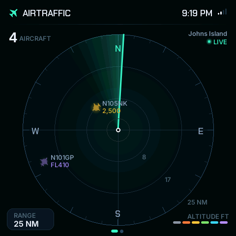
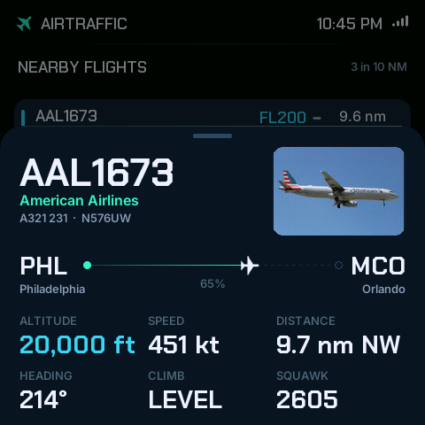
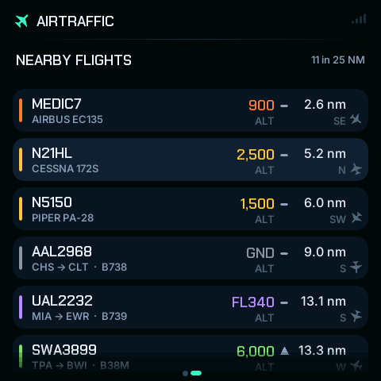
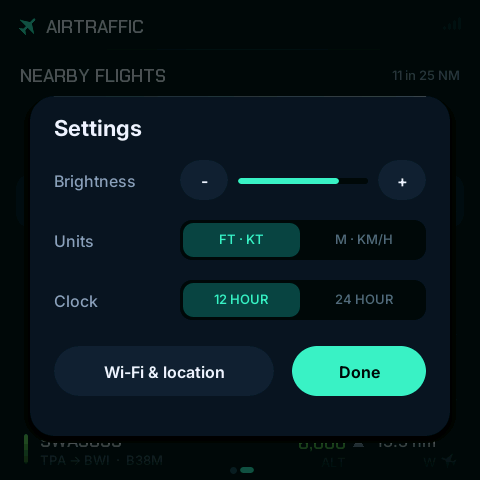
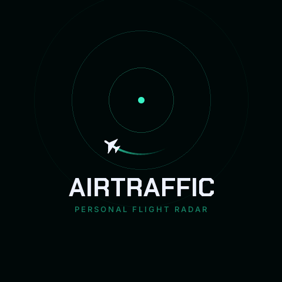
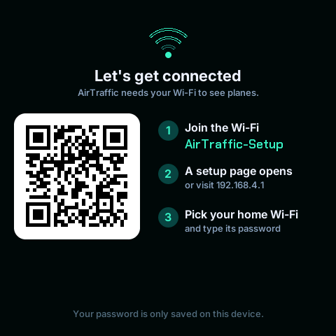

<h1 align="center">AirTraffic</h1>

<p align="center">
  A personal flight radar for your desk, on a $20 touchscreen.<br>
  Every aircraft near you, live, with a proper radar sweep, contrails and a
  card that tells you where each plane is going.<br>
  No server, no subscription, no API keys, no passwords in the code.
</p>

<p align="center">
  <a href="https://github.com/mcconnellcs/AirTraffic/actions/workflows/ci.yml"></a>
  <a href="LICENSE"></a>
  
  
</p>

| | |
|---|---|
|  |  |
|  |  |
|  |  |

*Real screenshots, pulled off the board over USB with `tools/screenshot.py`.*

## What it does

- **Radar view.** Planes within 10–100 nautical miles of you, drawn on a
  sweeping scope with range rings, compass, fading contrails and name tags.
  Colour = altitude. Emergencies pulse red. New arrivals "ping".
- **Smooth motion.** Positions arrive every 10 seconds; the radar predicts
  where each plane is in between (dead reckoning) and blends in each real
  update, so nothing jumps. 30 frames per second.
- **Tap a plane** for its card: callsign, airline, aircraft type and
  registration, route with a live progress bar (Charlotte → New York, 62%),
  altitude with climb/descent arrow, speed, distance and direction, heading,
  squawk, and a photo of the actual aircraft when one exists.
- **Nearby flights list**, nearest first, with routes.
- **Desk mode.** Leave it alone and it cycles through the nearest planes' cards.
- **Settings on the screen**: brightness, aviation or metric units, 12/24 h clock.
- **Wi-Fi setup from your phone** (QR code → setup page). Location is worked
  out automatically, or type your coordinates.
- **Free data**, straight from the community ADS-B feeds
  [adsb.lol](https://adsb.lol) and [adsb.fi](https://adsb.fi) (automatic
  failover), routes and aircraft facts from [adsbdb.com](https://adsbdb.com).
- **Demo mode** with 14 pretend planes, so you can try everything before Wi-Fi.

## Quick start

1. **Get the board:** an **ESP32-4848S040** (4.0" 480×480, ESP32-S3, 16 MB flash,
   8 MB PSRAM). About $20 from AliExpress or Amazon (search "ESP32-S3 4.0 inch
   480x480 AITRIP"). Plus a USB-C **data** cable.
2. **Install** Arduino IDE 2, the ESP32 core 3.3.x and three libraries —
   [step-by-step guide](docs/02-install-arduino.md).
3. **Flash** `firmware/BoardTest` to check the screen, then `firmware/AirTraffic`
   — [guide](docs/03-flash-it.md). Tools menu: *ESP32S3 Dev Module · 16MB ·
   16M Flash (3MB APP/9.9MB FATFS) · **OPI PSRAM***.
4. **Join the `AirTraffic-Setup` Wi-Fi** from your phone, pick your home
   network, done — [guide](docs/04-first-boot.md).

No Arduino IDE? Each [release](https://github.com/mcconnellcs/AirTraffic/releases)
has a ready-made `AirTraffic.ino.merged.bin` you can flash with `esptool`.

## The guides

Written for someone building their first ESP32 project.

1. [What you need](docs/01-what-you-need.md)
2. [Install the Arduino IDE](docs/02-install-arduino.md)
3. [Flash it](docs/03-flash-it.md)
4. [First boot and Wi-Fi](docs/04-first-boot.md) — also how to use the radar
5. [How it works](docs/05-how-it-works.md) — ADS-B, JSON, two cores, dead reckoning, strips
6. [Level-up missions](docs/06-level-up-missions.md) — 13 things to change, from easy to hard
7. [Troubleshooting](docs/troubleshooting.md)

## Using it

| Touch                          | Result                                        |
|--------------------------------|-----------------------------------------------|
| Tap a plane                    | Flight card                                   |
| Swipe down on the card         | Close it                                      |
| Swipe left / right on the card | Next / previous plane                         |
| Swipe left on the radar        | Flight list · swipe right to come back        |
| Tap RANGE                      | 10 → 25 → 50 → 100 NM                         |
| Press and hold                 | Settings                                      |

**Serial console** (Tools ▸ Serial Monitor, 115200 baud): `demo` (pretend
planes on/off), `shot` (screenshot, see below), `tap X Y`, `swipe left|right|up|down`,
`hold` (drive the screen from the keyboard), `help`.

**Screenshots:** `pip install pyserial pillow`, then
`python3 tools/screenshot.py /dev/ttyUSB0 radar.png` (use your port; add
`--reset 1.5` to catch the start-up animation).

## Hardware

Only one board is supported, on purpose: everything in this repository is
tested on it, and the pin wiring lives in a single commented file,
[`board_config.h`](firmware/AirTraffic/board_config.h).

| Board                 | Screen              | Chip     | Memory                 | Touch |
|-----------------------|---------------------|----------|------------------------|-------|
| ESP32-4848S040 (C_I)  | 4.0" IPS 480×480, ST7701S over 16-bit RGB | ESP32-S3 | 16 MB flash, 8 MB PSRAM | GT911 |

Sold as AITRIP / Guition / Sunton "ESP32-S3 4.0 inch 480×480 display". The
board also has 3 relay outputs and an I2C socket that this project doesn't use.

## Building and testing

- **Firmware:** Arduino IDE 2 with `esp32` core **3.3.12**, libraries
  **LovyanGFX 1.2.30**, **ArduinoJson 7.4.3**, **WiFiManager 2.0.17**. CI
  compiles with exactly these (see [`.github/workflows/ci.yml`](.github/workflows/ci.yml)).
- **Command line:** `arduino-cli compile --fqbn "esp32:esp32:esp32s3:PSRAM=opi,FlashSize=16M,PartitionScheme=app3M_fat9M_16MB" firmware/AirTraffic`
- **Unit tests** (no board needed): `make -C test`. They cover the geo maths,
  JSON parsers (against real saved API replies in `test/fixtures/`), number
  formatting, animation curves, gesture detection, the dead-reckoning sky
  model, settings rules and the demo flights. `make -C test coverage` prints
  line coverage (about 99% of that code).
- **Fonts:** `tools/fonts/make_fonts.py` turns the bundled TTFs into the smooth
  bitmap fonts in `fonts_data.cpp`.

## Project layout

```
firmware/
  AirTraffic/        the radar (open AirTraffic.ino in the Arduino IDE)
  BoardTest/         5-minute screen + touch check
docs/                the guides, and real screenshots in docs/images/
test/                host unit tests (doctest) + saved API replies
tools/               screenshot.py, fonts/make_fonts.py
```

## Credits

- Inspired by [esp32flight](https://github.com/CrassusXY/esp32flight), which
  proved a desk radar on a bare ESP32 is a great idea. AirTraffic is a
  from-scratch Arduino rewrite for a different board, aimed at beginners.
- Flight data by the volunteers feeding [adsb.lol](https://adsb.lol) and
  [adsb.fi](https://adsb.fi); routes and aircraft facts from
  [adsbdb.com](https://adsbdb.com); photos via airport-data.com;
  location from [ipwho.is](https://ipwho.is).
- Graphics by [LovyanGFX](https://github.com/lovyan03/LovyanGFX), JSON by
  [ArduinoJson](https://arduinojson.org), Wi-Fi setup by
  [WiFiManager](https://github.com/tzapu/WiFiManager), tests by
  [doctest](https://github.com/doctest/doctest).
- Fonts: [Inter](https://rsms.me/inter/) and
  [Chakra Petch](https://fonts.google.com/specimen/Chakra+Petch) (SIL Open Font License).

Please be kind to the free data feeds: the refresh rate (10 s) and the 250 NM
cap are there so one radar costs them almost nothing.

## License

[MIT](LICENSE). Build one, change it, share it.
