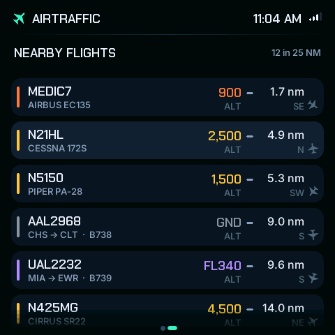
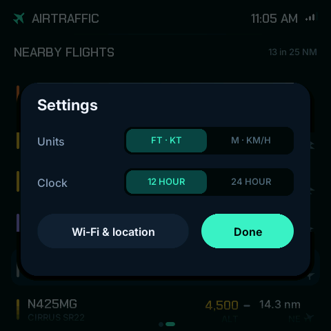

<h1 align="center">AirTraffic</h1>

<p align="center">
  A personal flight radar for your desk, on a touchscreen.<br>
  Nearby aircraft from community flight feeds, with a radar sweep, contrails,
  and flight cards with routes when available.<br>
  No server, no subscription, no API keys, no passwords in the code.
</p>

<p align="center">
  <a href="https://github.com/mcconnellcs/AirTraffic/actions/workflows/ci.yml"></a>
  <a href="LICENSE"></a>
  
  
</p>

| | |
|---|---|
|  |  |
|  |  |
|  |  |

*Real screenshots, pulled off the board over USB with `tools/screenshot.py`.
The radar, list and card show the built-in demo flights.*

## What it does

- **Radar view.** Planes within 10–100 nautical miles of you, drawn on a
  sweeping scope with range rings, compass, fading contrails and name tags.
  Colour = altitude. Emergencies pulse red. New arrivals "ping".
- **Smooth motion.** Downloads repeat after a 10-second pause; the radar
  estimates motion between reports (dead reckoning) and blends in updates.
  Rendering targets about 30 frames per second; actual performance varies.
- **Tap a plane** for its card: callsign, aircraft type and registration, plus
  airline, logo, and route when available, with an estimated progress bar,
  altitude with climb/descent arrow, speed, distance and direction, heading,
  squawk, and an aircraft photo when available from the supported source.
- **Nearby flights list**, nearest first, with routes.
- **Desk mode.** Leave it alone and it cycles through the nearest planes' cards.
- **Settings on the screen**: aviation or metric units, 12/24 h clock, Wi-Fi setup.
- **Wi-Fi setup from your phone** (QR code → setup page). Location is worked
  out automatically, or type your coordinates. In homes with several access
  points it joins the strongest one, and moves if the signal gets poor.
- **Free data**, straight from the community ADS-B feeds
  [adsb.lol](https://adsb.lol) and [adsb.fi](https://adsb.fi) (automatic
  failover), routes and aircraft facts from [adsbdb.com](https://adsbdb.com).
- **Demo mode** with 14 simulated planes and routes. Set RANGE to 50 NM to
  see the full initial set; photos are absent and logos still need internet.

## Start here — first build on a Mac

No coding experience or Terminal commands are needed for the main build.
You will install Arduino IDE, upload a screen test, then upload the radar.
Allow an afternoon, including downloads. Use the **same ESP32-4848S040C_I
board** as the working project; similarly named displays can have different wiring.

1. [Check the board, Mac, USB data cable, and 2.4 GHz Wi-Fi](docs/01-what-you-need.md).
2. [Install Arduino IDE and the exact tested dependencies](docs/02-install-arduino.md):
   **ESP32 3.3.12**, **LovyanGFX 1.2.30**, **ArduinoJson 7.4.3**,
   **WiFiManager 2.0.17**. The guide lists every important Tools setting.
3. [Download/unzip the project and upload BoardTest, then AirTraffic](docs/03-flash-it.md).
   Check the colours, animation, and touch **before** continuing past BoardTest.
4. [Connect Wi-Fi and check the radar](docs/04-first-boot.md). Try `demo` if
   no real aircraft are nearby, then restart to check saved Wi-Fi reconnects.

### What you'll learn along the way

The guides explain *why* as well as *what*. Short **Why?** notes sit beside
the steps, longer **Learn more** sections fold out if you want them, and every
abbreviation is in the [glossary](docs/glossary.md). By the end you will have
met:

- **Hardware:** what a microcontroller is, the difference between flash
  storage and working memory, and why a USB cable can be the wrong kind.
- **Tools:** compiling and uploading, libraries, and why projects pin exact
  versions.
- **Networking:** 2.4 GHz and 5 GHz Wi-Fi, IP addresses, HTTP and HTTPS, and
  why passwords never belong in source code.
- **Data:** how a program asks a website for information and reads the JSON
  that comes back.
- **Aviation:** how aircraft announce their position (ADS-B), and what
  callsigns, squawk codes, knots and flight levels mean.
- **Debugging:** testing the simplest thing first, reading the first error,
  and using the Serial Monitor to see what a device is thinking.

**Success looks like:** BoardTest passes, AirTraffic responds to touch,
`status` reports a live feed (even if empty), and Wi-Fi reconnects after unplugging.
If a checkpoint fails, use [Troubleshooting](docs/troubleshooting.md).

Live data depends on internet access and volunteer receiver coverage. It does
not show every aircraft; up to 60 nearest reported aircraft are retained per
fetch. Location from an IP address may be far from your home; enter coordinates
if needed. Routes, photos, and logos are optional, and motion/progress are
estimates. This is a hobby display, not a navigation instrument.

The [validation record and hardware checklist](docs/validation.md) distinguish
software checks from checks still needed on the physical board. Ready-made
[release firmware](https://github.com/mcconnellcs/AirTraffic/releases) is an
[optional alternative](docs/03-flash-it.md#ready-made-firmware-optional-alternative)
and can be older than the source on `main`.

## The guides

Written for someone building their first ESP32 project.

1. [What you need](docs/01-what-you-need.md)
2. [Install the Arduino IDE](docs/02-install-arduino.md)
3. [Flash it](docs/03-flash-it.md)
4. [First boot and Wi-Fi](docs/04-first-boot.md) — also how to use the radar
5. [How it works](docs/05-how-it-works.md) — ADS-B, JSON, two cores, dead reckoning, strips
6. [Level-up missions](docs/06-level-up-missions.md) — ideas to try after the basic build works
7. [Troubleshooting](docs/troubleshooting.md)
8. [Glossary](docs/glossary.md) — every abbreviation and technical word, explained

## Using it

| Touch                          | Result                                        |
|--------------------------------|-----------------------------------------------|
| Tap a plane                    | Flight card                                   |
| Swipe down on the card         | Close it                                      |
| Swipe left / right on the card | Next / previous plane                         |
| Swipe left on the radar        | Flight list · swipe right to come back        |
| Tap RANGE                      | 10 → 25 → 50 → 100 NM                         |
| Press and hold                 | Settings                                      |

**Serial console** (Tools ▸ Serial Monitor, 115200 baud, **New Line**): `status` (Wi-Fi,
feed and memory), `scan` (every Wi-Fi network the board can see), `demo`
(pretend planes on/off), `shot` (screenshot, see below), `tap X Y`,
`swipe left|right|up|down`, `hold` (drive the screen from the keyboard), `help`.

**Screenshots and optional developer commands:** see
[Developer tools](docs/development.md). These are not needed to build the radar.

## Hardware

This project targets one board. The main sketch's wiring is documented in
[`board_config.h`](firmware/AirTraffic/board_config.h).

| Board                 | Screen              | Chip     | Memory                 | Touch |
|-----------------------|---------------------|----------|------------------------|-------|
| ESP32-4848S040 (C_I)  | 4.0" IPS 480×480, ST7701S over 16-bit RGB | ESP32-S3 | 16 MB flash, 8 MB PSRAM | GT911 |

Similar listings use AITRIP / Guition / Sunton names; match the exact model and
components in [What you need](docs/01-what-you-need.md). BoardTest has its own
copy of `board_config.h`; a hardware fix must be applied to both sketches.
The relay outputs and I2C socket are not used.

## Building and testing

The [installation guide](docs/02-install-arduino.md) pins the same dependency
versions as [CI](.github/workflows/ci.yml), which compiles **both sketches**
and runs the host tests. [Developer tools](docs/development.md) covers CLI
setup, tests, screenshots, and fonts. No generated assets need rebuilding for
the normal Arduino IDE path.

Host tests check maths, JSON parsing, formatting, animations, gestures,
settings, simulated flights, screenshot encoding, and Wi-Fi setup logic with
simulated APIs. They
do not verify real touch, display timing, USB upload, or radio behavior; use
the [hardware checklist](docs/validation.md) for those.

## Project layout

```
firmware/
  AirTraffic/        the radar (open AirTraffic.ino in the Arduino IDE)
  BoardTest/         5-minute screen + touch check
docs/                the guides, and real screenshots in docs/images/
test/                host unit tests (doctest) + saved API replies
tools/               screenshot.py, fonts/make_fonts.py
```

## Credits

- Inspired by [esp32flight](https://github.com/CrassusXY/esp32flight), which
  proved a desk radar on a bare ESP32 is a great idea. AirTraffic is a
  from-scratch Arduino rewrite for a different board, aimed at beginners.
- Flight data by the volunteers feeding [adsb.lol](https://adsb.lol) and
  [adsb.fi](https://adsb.fi); routes and aircraft facts from
  [adsbdb.com](https://adsbdb.com); photos via airport-data.com; airline
  logos from [esp32flight-logos](https://github.com/theqkash/esp32flight-logos)
  (trademarks of their airlines, shown only to identify them);
  location from [ipwho.is](https://ipwho.is).
- Graphics by [LovyanGFX](https://github.com/lovyan03/LovyanGFX), JSON by
  [ArduinoJson](https://arduinojson.org), Wi-Fi setup by
  [WiFiManager](https://github.com/tzapu/WiFiManager), tests by
  [doctest](https://github.com/doctest/doctest).
- Fonts: [Inter](https://rsms.me/inter/) and
  [Chakra Petch](https://fonts.google.com/specimen/Chakra+Petch) (SIL Open Font License).

Please be kind to the free data feeds: the refresh rate (10 s) and the 250 NM
cap limit this project's requests. Availability and access policies can change.
See the providers' [adsb.lol API documentation](https://www.adsb.lol/docs/open-data/api/)
and [adsb.fi API documentation](https://github.com/adsbfi/opendata).

## License

[MIT](LICENSE). Build one, change it, share it.
