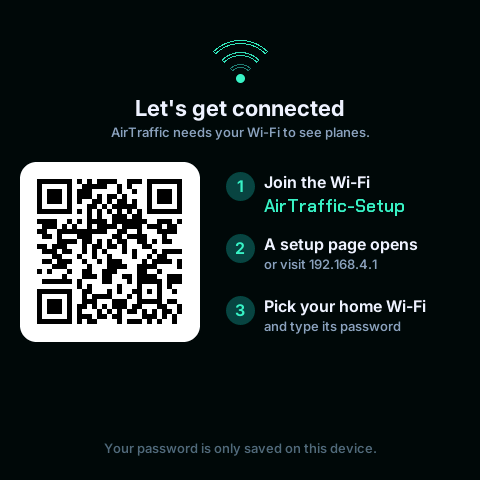
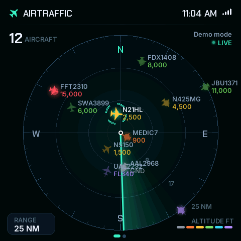
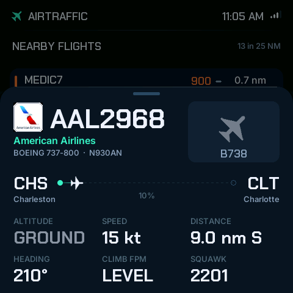

# 4. First boot and Wi-Fi

On a fresh board, AirTraffic creates a setup hotspot so you can enter Wi-Fi
settings from your phone. You never put the Wi-Fi password in the source code.
If the board remembers a working network, it can skip setup.
Unfamiliar word? See the [glossary](glossary.md).

> **Why a hotspot instead of typing the password into the code?** Many
> beginner projects have a line like `password = "..."` in the program. That
> works until you share the code, and then your password is shared too.
> Passwords and keys left in published code are one of the most common
> security mistakes, including among professionals. Here the password is
> typed into the *board* and stored in its flash memory, so the code can be
> public and the same program works on anyone's Wi-Fi.
>
> **How does the board become a hotspot?** A Wi-Fi radio can either *join* a
> network or *be* one. With no network to join, the board becomes a small
> network of its own, called `AirTraffic-Setup`, and runs a tiny web server
> with one page on it. Pages that open by themselves when you join a network
> are called *captive portals*; hotel and airport Wi-Fi use the same trick.



## Connect it to your Wi-Fi

1. Keep the board powered. On your phone, join **AirTraffic-Setup** in Wi-Fi
   settings, or scan the on-screen QR code to join it. It has no password.
2. If the phone says **No Internet**, choose to **stay connected**. That is
   expected: this hotspot is only a local setup page.
3. If a page does not open automatically, type **http://192.168.4.1** into
   the browser's address bar. Use `http`, not `https`, and do not search for it.
4. Tap **Configure WiFi**, choose your **2.4 GHz** home network, enter its
   password, and tap **Save**. Optional location/units fields are explained below.
5. Allow up to a minute for connection, location lookup, and the first flight
   download. The radar should appear. If your phone stays on AirTraffic-Setup
   after setup, manually switch it back to your normal Wi-Fi.

Setup sends the password from your phone to the board over a local, open Wi-Fi
hotspot and HTTP page. Do this at home. The board stores the credentials for
reconnecting; the application does not send them to flight-data services or
put them in your repository.

> **Why `http` and not `https`, and what is `192.168.4.1`?** Every device
> on a network has a numeric *IP address*. Addresses beginning `192.168.` are
> reserved for private networks and never appear on the internet;
> `192.168.4.1` is the one the board gives itself. **HTTPS** encrypts a
> connection and checks a site's identity using a *certificate*, which is
> issued to a website name by a trusted organisation. A gadget on your desk has
> no website name, so it cannot have one, and plain **HTTP** is the only
> option. That is the reason for "do this at home": for those few seconds the
> password travels unencrypted, but only over the couple of metres between
> your phone and the board. Once set up, the board's downloads all use HTTPS.
>
> **Why "No Internet"?** Your phone has joined the board's network, and the
> board is not connected to anything yet. The phone is warning you that this
> network leads nowhere, which is true and expected.

## Location and units

- **Latitude / Longitude:** leave **both** blank for an approximate location
  based on your public internet address. This may be many miles away, especially
  with a VPN or mobile internet. Check the place shown at the top of the radar.
- For an exact radar centre, enter **both** coordinates as decimal numbers:
  latitude first (−90 to 90), longitude second (−180 to 180). For example,
  `32.7763` and `-79.9311`. Use a decimal point and a minus sign for south/west;
  do not include degree symbols, compass letters, or a comma in either box.
  In Google Maps on a computer, right-click a location to see its coordinates.
- A missing or invalid coordinate makes the current firmware use **automatic
  location**. There is no form error message, so confirm the centre afterward.
- **Units:** enter `aviation` (feet, knots, nautical miles) or `metric`
  (metres, km/h, kilometres). Settings on the display can also change this.
  The RANGE button's underlying choices remain 10, 25, 50, and 100 **NM**.

<details>
<summary><b>Learn more:</b> latitude, longitude, and how the board guesses where it is</summary>

**Latitude and longitude** are two angles that pin down any point on Earth.

- **Latitude** is how far north or south of the equator you are: 0° at the
  equator, +90° at the North Pole, −90° at the South Pole.
- **Longitude** is how far east or west you are of a line through Greenwich,
  London: from −180° to +180°. West is negative, so everywhere in the Americas
  has a negative longitude.

Charleston, South Carolina is at about `32.78, -79.93`: 32.78° north,
79.93° west. Four decimal places is accurate to about 11 metres, which is
more than the radar needs.

**The automatic guess.** Every internet connection has a public IP address,
handed out by the internet provider. Companies keep lists of roughly where each
block of addresses is used, and the board asks one of them. This is *IP
geolocation*. It knows where your provider's equipment is, not where your house
is, so it is often right to the nearest town and sometimes wrong by a long way.
The board has no GPS receiver, so typed coordinates are the only way to get an
exact centre.

**Why aviation units?** Aviation everywhere uses the same units so that
pilots and controllers in any country understand each other:

| Quantity | Unit | In everyday terms |
|---|---|---|
| Distance | nautical mile (NM) | 1.852 km, or 1.15 miles |
| Speed | knot (kt) | 1 nautical mile per hour: 1.85 km/h, or 1.15 mph |
| Altitude | foot (ft) | 0.3048 m |
| Climb or descent | feet per minute (fpm) | |

A nautical mile is one-sixtieth of a degree of latitude, which makes
navigating by map simple: one degree north is always 60 NM.

</details>

To reopen setup later: press and hold on the radar/list/card, tap
**Wi-Fi & location**, then join AirTraffic-Setup again. Selecting your network
and tapping Save applies the new fields. If you choose Exit without saving,
restart the board if needed to return to its saved connection.

## First success check

Open **Tools ▸ Serial Monitor** in Arduino IDE. Set **115200 baud** and choose
**New Line** in the line-ending selector. Opening Serial Monitor can restart
the board; if the start-up animation plays, **wait until the radar is back**
(about 20 seconds) before going on. Then type `status` into the input box
and press Return. Commands need a line ending; **No line ending** will not work.

The reply is three lines starting with `[status]`. Look for **Wi-Fi
connected**, **feed: live**, and source **adsb.lol** or **adsb.fi**. If it
says `waiting for Wi-Fi`, `locating` or `loading`, the board is still starting:
wait ten seconds and send `status` again. A live feed with zero nearby aircraft is still a successful build.
The green/live indicator confirms a successful download, not complete coverage.

<details>
<summary><b>Learn more:</b> reading the <code>status</code> reply</summary>

```text
[status] Wi-Fi connected to MyNetwork (AP 7E:FA:…, channel 11), IP 192.168.1.57, signal -52 dBm
[status] feed: live, source adsb.lol, 6 in range, last update 3 s ago
[status] home 32.7763, -79.9327 (Charleston), heap 112 KB, psram 7104 KB
```

| Part | Meaning |
|---|---|
| `AP 7E:FA:…` | The hardware address of the access point the board is talking to. A home can have several sharing one network name. |
| `channel 11` | Which "lane" of the 2.4 GHz band that access point uses. |
| `IP 192.168.1.57` | The address your router gave the board. |
| `signal -52 dBm` | Signal strength. Always negative; closer to zero is stronger. About −40 is excellent, −60 good, −70 weak, −80 barely usable. Every 10 dBm lower is ten times less power. |
| `feed: live` | The last download worked. Other values: `waiting for Wi-Fi`, `locating`, `loading`, `error`. |
| `source adsb.lol` | Which flight-data website answered. |
| `6 in range` | Aircraft inside the radar's range in the last download. |
| `home …` | The centre of the radar, and the name of the place. |
| `heap`, `psram` | Free working memory: built-in and extra. If these shrank steadily over hours, the program would have a *memory leak*. |

</details>

Unplug USB for a few seconds and reconnect it. The board should reconnect
using the saved network. This is the final check that setup was saved.

## Try the demo, even before setting up Wi-Fi

With AirTraffic running, send `demo` in Serial Monitor (115200 baud,
**New Line**). Wait a few seconds for the radar to appear with **Demo mode** shown.
Tap RANGE until it is **50 NM** to see the full initial set of 14 simulated
planes. At smaller ranges, some are deliberately outside the view.

Demo includes simulated routes and aircraft facts. Photos are absent and
logos still need internet. Send `demo` again to return to live data, or
restart the board (unplug and replug USB); demo mode is not saved. With no working Wi-Fi, live data must
wait for setup. Demo mode is a useful check when there are no real planes nearby.

## Using the radar



| Do this | Result |
|---|---|
| Tap a plane | Open its flight card |
| Swipe **down** on the card | Close the card |
| Swipe **left / right** on the card | Next / previous plane, ordered by distance |
| Swipe **left** on the radar | Open the nearby-flight list |
| Swipe **right** on the list | Return to radar |
| Swipe **up / down** on the list | Scroll the list |
| Tap a list row | Open that plane's card |
| Tap **RANGE** on the radar | Cycle 10 → 25 → 50 → 100 nautical miles |
| **Press and hold** on radar/list/card | Settings: units, 12/24-hour display, Wi-Fi/location |

After **one minute without touching the radar**, desk mode cycles through up
to the five nearest planes, one card every **12 seconds**. Touch once to leave
desk mode; that first touch wakes the display instead of selecting a control.
It does not start from the list or while Settings is open.

## What the data means

| Colour | Reported altitude |
|---|---|
| Grey | On the ground |
| Orange | Below 1,000 ft |
| Yellow | 1,000 to below 5,000 ft |
| Green | 5,000 to below 15,000 ft |
| Cyan | 15,000 to below 30,000 ft |
| Purple | 30,000 ft or higher |

Altitude colours use feet even in metric mode. A missing altitude can also
appear orange; check the card rather than assuming it is low. Red pulses mark
reported squawk codes 7500, 7600, or 7700. The demo intentionally includes one.

<details>
<summary><b>Learn more:</b> how to read a flight card</summary>



| On the card | Example | Meaning |
|---|---|---|
| Callsign | `AAL2968` | What air traffic control calls this flight. The first three letters are the airline's **ICAO** code (`AAL` = American Airlines); the rest is the flight number. On a ticket the same flight is `AA2968`, using the two-character **IATA** code. |
| Type and registration | `BOEING 737-800 · N930AN` | The kind of aircraft, and that one aircraft's "number plate". `N` means registered in the USA. |
| Route | `CHS → CLT` | Origin and destination airports by their three-letter **IATA** codes, the ones on luggage tags. The percentage is how far along it is, estimated from its position. |
| Altitude | `20,000 ft`, `GROUND` | Height above sea level. On the radar and the list, where space is tight, heights of 18,000 ft and above are shortened to a **flight level**: `FL350` is 35,000 ft. |
| Speed | `451 kt` | Speed over the ground in knots. 451 kt is about 520 mph. |
| Distance | `9.7 nm NW` | How far away it is from the radar's centre, and in which direction. |
| Heading | `214°` | The way it is travelling: 0° north, 90° east, 180° south, 270° west. |
| Climb | `+1,200`, `-640`, `LEVEL` | Feet per minute, up or down. |
| Squawk | `2605` | A four-digit code the pilot sets so controllers can tell aircraft apart. |

**Emergency squawk codes.** Three codes are reserved worldwide, and the radar
highlights them in red:

| Code | Meaning |
|---|---|
| `7500` | Unlawful interference (hijacking) |
| `7600` | Radio failure: the pilot cannot hear or talk to controllers |
| `7700` | General emergency |

They are rare, and when one does appear it is usually a precaution, a test or
a mistake in setting the code. In the USA `1200` is the everyday code for
small aircraft flying by sight rather than under air traffic control.

**Why can I see this at all?** Aircraft broadcast their position openly so
that other aircraft and controllers can avoid them. Nothing here is secret or
decoded; it is the same data the flight-tracking websites show. Some aircraft
are missing because they carry older equipment, or because no volunteer
receiver is close enough to hear them.

</details>

This is a hobby display, not an air-traffic-control or navigation instrument.
Community coverage varies; some aircraft, routes, logos, and photos will be
missing. Up to **60 nearest reported aircraft** are retained per download.
Positions between downloads and route progress are estimates, and downloaded
reports may already be delayed. Missing details do not mean your build failed.

> **Why does the board need the internet to tell the time?** A computer keeps
> time with a small battery-powered clock chip. This board has none, so every
> time it starts it believes it is 1970. It asks a time server using **NTP**
> (Network Time Protocol), which answers in **UTC**, the world's reference
> time. To show *your* time it then adds your time zone's offset.

The clock gets its time from NTP and its time-zone offset from the public-IP
lookup, even when radar coordinates are manual. It does not follow the time
zone of coordinates you enter, and the offset does not automatically update
at a daylight-saving change. Restart afterward to refresh it. If the location
service is unavailable with manual coordinates, the clock uses UTC.

**Something wrong?** Start with [Troubleshooting](troubleshooting.md).

Next: [5. How it works](05-how-it-works.md)
