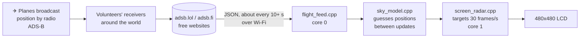

# 5. How it works

You don't need to read this to use the radar. Read it when you want to change it.

## The big picture


```mermaid
flowchart LR
    P[✈ Planes broadcast<br>position by radio<br>ADS-B] --> R[Volunteers' receivers<br>around the world]
    R --> W[(adsb.lol / adsb.fi<br>free websites)]
    W -- "JSON, about every 10+ s<br>over Wi-Fi" --> F[flight_feed.cpp<br>core 0]
    F --> S[sky_model.cpp<br>guesses positions<br>between updates]
    S --> D[screen_radar.cpp<br>targets 30 frames/s<br>core 1]
    D --> L[480x480 LCD]
```

Many aircraft carry a transmitter that broadcasts position, altitude, and
speed using **ADS-B**. Reception depends on the aircraft equipment and nearby
receivers.
Thousands of hobbyists run cheap receivers and pool what they hear on free
websites. We ask one of those websites: *"what's flying within 25 nautical miles of
here?"* and it answers with a list.

## Step by step

### 1. Wi-Fi (`wifi_setup.cpp`)

The WiFiManager library either connects to the network it remembers, or opens
the `AirTraffic-Setup` hotspot and serves the setup page. Settings you type there
are saved in the ESP32's flash with the `Preferences` library
(`app_settings.cpp`) so they survive being unplugged.

### 2. Where are we? (`flight_feed.cpp` → `locate()`)

The board asks `ipwho.is` where its internet connection is. That gives a city
and rough coordinates, plus the time zone, which we use to set the clock from
the internet (NTP).

### 3. Downloading planes (`net_client.cpp`, `flight_feed.cpp`)

After each position download we wait ten seconds before fetching again.
Network delays can lengthen that interval. For the default 25 NM view, we use a
slightly larger query radius to include approaching aircraft, with a URL like
`https://api.adsb.lol/v2/point/32.77/-79.93/35` (latitude, longitude, radius).
The reply is **JSON**, a text format that looks like this:

```json
{"ac": [
  {"hex": "ad727d", "flight": "AAL1699", "t": "B738",
   "alt_baro": 35000, "gs": 444.9, "track": 28.7,
   "lat": 32.911, "lon": -80.705}
]}
```

`parsers.cpp` uses the ArduinoJson library to pull those fields out into a
`Flight` struct (`flight.h`). If the first website is down we try a second one.

When you open a card, the same task looks up the route and aircraft facts on
adsbdb.com, then fetches the airline logo (a small PNG, by ICAO airline code,
from the esp32flight-logos collection) and a photo of the aircraft. Logos are
kept in a 12-entry cache to reduce repeat downloads; entries can be evicted.

**Why HTTPS works without any setup:** the ESP32 core ships with a bundle
of trusted certificate authorities, so the board can check
it's really talking to adsb.lol.

### 4. Two brains (`flight_feed.cpp`, `ui_canvas.cpp`)

The ESP32-S3 has **two processor cores**. Downloading can take a second or two,
and if we did it on the same core that draws the screen, the animation would
freeze every 10 seconds. So:

- **Core 0** runs `flight_feed`: downloads and JSON. A separate `strip_push`
  task on core 0 copies finished picture strips to the screen (more below).
- **Core 1** runs Arduino's `loop()`: Wi-Fi setup processing, touch, animation,
  and drawing. Network scans can briefly pause this loop.

They share data through a **mutex** — a lock that means "only one core may
touch this at a time".

### 5. Filling in the gaps (`sky_model.cpp`)

Position downloads are roughly ten seconds apart but we target 30 frames per
second. A jet at 450 knots moves over a mile between updates, so if we only
drew the reported positions, planes would teleport.

Instead we use **dead reckoning**, the same trick sailors used before GPS:

> new position = last known position + speed × time, in the direction of travel

When a fresh report arrives we blend from where we *guessed* to where the plane
*really is* over one second, to soften sudden position changes. Planes that
appear fade in; planes missing from a successful download fade out. Failed
downloads leave the last known tracks on screen, with an error indicator.

### 6. Drawing fast (`ui_canvas.cpp`)

A 480×480 picture is 460 KB. That only fits in the board's slow external
memory (PSRAM), and redrawing it there took 130 ms per frame — 7 frames a
second. Three tricks got it to 30:

1. **Strips.** The screen is drawn in 10 horizontal strips of 48 rows. A strip
   is 46 KB, small enough for the ESP32's fast internal RAM. The drawing code
   doesn't know: it uses normal screen coordinates and anything outside the
   current strip is clipped.
2. **Two cores again.** While core 1 draws strip 5, core 0 copies strip 4 to the
   screen. Two strip buffers, so they never collide.
3. **Layers.** The rings, compass and title never change, so they're drawn once
   at start-up and stored as *runs* ("47 pixels of dark blue, 1 of grey, ...").
   Painting a layer is just a few fast fills.

Text, lines, the radar sweep and glows are written straight into the strip's
memory (`ui_text.cpp`, `ui_canvas.cpp`) because calling the graphics library
thousands of times per frame was the next bottleneck.

### 7. Screens (`screen_*.cpp`)

Each screen is a function that draws one strip: `drawRadar`, `drawCard`,
`drawList`, `drawSettings`, `drawBoot`, `drawSetup`. `app.cpp` decides which
ones to call and reacts to touches (`gesture.cpp` turns raw finger positions
into taps, swipes and long presses). Animations use `anim.h`: a `Tween` knows
"go from A to B starting now, taking 400 ms" and an easing curve gives the
motion its feel.

## Where things live

| File(s)                      | Job                                                   |
|------------------------------|-------------------------------------------------------|
| `AirTraffic.ino`             | The 10-line start: `setup()` and `loop()`             |
| `app.cpp`                    | The brain: which screen, what a touch does            |
| `board_config.h`             | Which pins the screen and touch chip are wired to     |
| `theme.h`                    | Every colour and font in one place                    |
| `app_settings.*`             | Your saved choices                                    |
| `wifi_setup.*`               | Wi-Fi + the setup hotspot                             |
| `net_client.*`               | Download a URL over HTTPS                             |
| `parsers.*`, `flight.h`      | JSON → `Flight` structs                               |
| `flight_feed.*`              | The background download task (core 0)                 |
| `sky_model.*`                | Dead reckoning, trails, fade in/out                   |
| `geo.*`, `format.*`, `anim.h`| Maths, number formatting, animation curves            |
| `gesture.*`                  | Taps, swipes, long presses                            |
| `ui_canvas.*`, `ui_pixels.h` | Strips, layers, fast drawing                          |
| `ui_text.cpp`, `ui_fonts.*`  | Smooth fonts (made by `tools/fonts/make_fonts.py`)    |
| `ui_icons.cpp`               | The rotating aircraft symbol                          |
| `screen_*.cpp`, `ui_chrome.cpp` | The screens                                        |
| `demo_flights.*`             | The pretend planes for `demo` mode                    |
| `serial_console.*`           | `demo`, `shot`, `tap`, `swipe`, `hold`                |
| `test/`                      | Unit tests that run on your computer                  |

## Testing without a board

The maths, parsers, formatting, animation, gesture, sky-model, settings, and
demo code can be tested on a computer. Separate tests simulate Wi-Fi APIs to
exercise the setup controller. The saved JSON replies in `test/fixtures/`
check parsers without needing the live websites.

See [Developer tools](development.md#host-tests-no-board-needed) for the Mac
compiler prerequisites and commands. These tests cannot prove the physical
screen, touch, radio, or power supply works; that is what BoardTest and the
[hardware checklist](validation.md) are for.

Next: [6. Level-up missions](06-level-up-missions.md)
